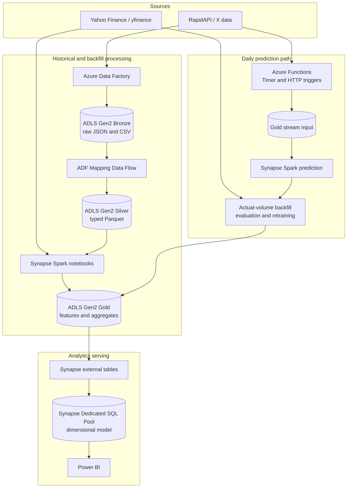
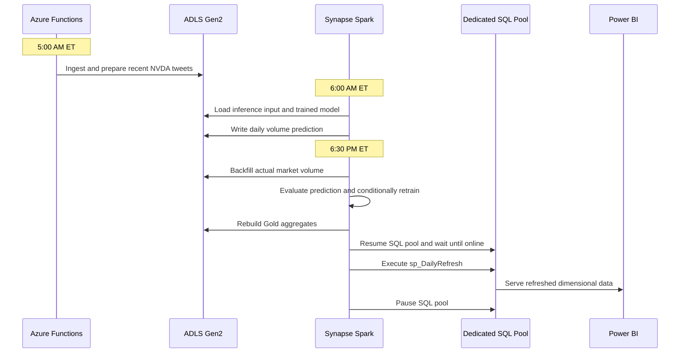

# From Tweets to Trends: Predicting NVDA Stock Volume with X Sentiment

An end-to-end Azure data engineering and machine learning project that combines X/Twitter sentiment with NVDA market data to predict trading-session volume.

The project demonstrates batch ingestion, medallion architecture, Spark transformation, feature engineering, model training and evaluation, scheduled inference, conditional retraining, dimensional modeling, warehouse refresh, and cost-aware orchestration.

> This is an educational data engineering project, not financial or investment advice.

## Project goals

- Build a reproducible data pipeline from external APIs to an analytical warehouse.
- Preserve raw source data while producing typed, deduplicated, analytics-ready datasets.
- Join social sentiment signals with stock-market observations at the correct trading-session grain.
- Train and evaluate a Spark ML regression model for NVDA volume prediction.
- Operationalize daily prediction, actual-volume backfill, conditional retraining, and BI refresh.
- Demonstrate production-oriented concepts such as idempotency, retries, managed identities, secret isolation, scheduling, and compute cost control.

## Architecture



The historical and daily paths intentionally serve different purposes:

- The historical path builds training and analytical datasets through Bronze, Silver, and Gold layers.
- The daily path is a scheduled micro-batch workflow that prepares a small inference-ready tweet set, predicts the upcoming trading-session volume, and later backfills the actual result.

## Medallion layers

### Bronze

Bronze preserves source data with minimal transformation:

- Raw X/Twitter API responses in JSON.
- Raw NVDA market history from Yahoo Finance.
- Date-partitioned historical backfills.

### Silver

Silver contains clean, typed, and reusable Parquet datasets:

- Flattened tweet and user fields.
- Parsed timestamps and derived calendar attributes.
- Null filtering and historical deduplication.
- Typed NVDA price and volume history.

### Gold

Gold contains model- and BI-ready data:

- VADER sentiment features.
- Tweet and user engagement features.
- Trading-session mapping and market-volume labels.
- Prediction history and evaluation results.
- Daily and monthly analytical aggregates.

## Daily orchestration



The Azure Function timer runs at both `09:05 UTC` and `10:05 UTC` to cover Eastern daylight-saving changes. An `America/New_York` guard executes the ingestion only when the local hour is 5.

## Machine learning workflow

The Spark ML workflow uses a `RandomForestRegressor` to predict NVDA trading volume from historical market and sentiment features.

The notebooks include:

- Time-aware feature preparation.
- Historical training and validation.
- RMSE, MAE, and R² evaluation.
- Session-level evaluation in addition to row-level metrics.
- Persisted model artifacts for daily inference.
- Actual-volume backfill after market close.
- Threshold-based conditional retraining.

Model accuracy is not the sole focus of this repository. The primary goal is to demonstrate how data ingestion, feature pipelines, model lifecycle steps, orchestration, and analytical serving fit together.

## Analytical serving model

Gold Parquet datasets are exposed through Synapse external tables and loaded into a dimensional warehouse.

Core warehouse objects include:

- `DimDate`
- `DimUser`
- `FactDailyTweet`
- `FactMarketSummaryPerDay`
- `FactViralTweetLog`
- `FactUserTypeDistribution`
- `FactTopUsersByTweetCount`
- `FactTopUsersByViralTweets`
- `FactInfluencerMonthlyEngagement`
- `FactPrediction`

`sp_DailyRefresh` refreshes the serving tables from the external Gold layer. The orchestration resumes the dedicated SQL pool only when needed and pauses it after refresh to control compute cost.

## Azure services and responsibilities

| Service | Responsibility |
| --- | --- |
| Azure Data Factory | Historical API ingestion, backfill loops, and Bronze-to-Silver data flows |
| Azure Functions | Daily timer-triggered ingestion and an HTTP test endpoint |
| ADLS Gen2 | Bronze, Silver, Gold, model, and prediction storage |
| Synapse Spark | Feature engineering, aggregation, training, prediction, evaluation, and retraining |
| Synapse Pipelines | Daily orchestration, dependencies, SQL pool lifecycle, and warehouse refresh |
| Synapse Dedicated SQL Pool | Dimensional serving model for BI workloads |
| Managed Identity | Passwordless access between Azure compute and storage |
| Power BI | Dashboard and analytical consumption layer |

## Repository structure

```text
.
├── adf/                    # Native ADF Git artifacts
│   ├── dataflow/
│   ├── dataset/
│   ├── factory/
│   ├── linkedService/
│   └── pipeline/
├── function-app/           # Azure Functions Python source
│   ├── function_app.py
│   ├── host.json
│   ├── local.settings.example.json
│   └── requirements.txt
├── sql/                    # Portable standalone SQL deployment scripts
│   ├── 01_external_objects.sql
│   ├── 02_prediction_objects.sql
│   ├── 03_dimensional_warehouse.sql
│   ├── 04_sp_daily_refresh.sql
│   └── README.md
└── synapse/                # Native Synapse Git artifacts
    ├── credential/
    ├── integrationRuntime/
    ├── linkedService/
    ├── notebook/
    ├── pipeline/
    ├── sqlscript/
    └── trigger/
```

The native ADF and Synapse JSON files are retained because they preserve pipeline topology, activity dependencies, notebook definitions, triggers, linked services, and deployment metadata. The `sql/` directory provides readable standalone SQL for review and platform migration.

## Security and configuration

No API keys, passwords, storage access keys, SAS tokens, or connection strings should be committed to this repository.

- `RAPIDAPI_KEY` is read from the Function App environment.
- Storage access uses `DefaultAzureCredential` and Managed Identity.
- `local.settings.json` and `.env` files are excluded by `.gitignore`.
- `local.settings.example.json` contains placeholders only.
- Synapse notebook artifacts use `<storage-account-name>` instead of the original ADLS account name.
- Native ADF and Synapse connection artifacts retain non-secret resource identifiers and service endpoints that describe the original deployment; replace them for a new environment.
- The standalone SQL scripts use `<storage-account-name>` instead of a live ADLS hostname.

## Local Function configuration

Copy the example settings file for local development:

```bash
cp function-app/local.settings.example.json function-app/local.settings.json
```

Then provide local values for:

```text
RAPIDAPI_HOST
RAPIDAPI_KEY
STORAGE_ACCOUNT_NAME
GOLD_CONTAINER
TWITTER_QUERY
TWITTER_COUNT
PREDICTION_CUTOFF_HOUR_ET
```

Never commit `local.settings.json`.

## Design decisions

- The project uses scheduled micro-batches rather than a true continuous streaming system.
- Fact-table grain is defined before selecting measures and dimensions.
- Raw data is retained in Bronze to support replay and debugging.
- Parquet is used in Silver and Gold for typed, columnar analytical access.
- Historical deduplication prevents repeated API backfills from duplicating tweets.
- Eastern Time and trading-session cutoffs are handled explicitly instead of relying on UTC calendar dates.
- The SQL pool is resumed only for refresh and paused afterward for cost control.
- API volume and historical range are intentionally limited for an educational rebuild.

## AWS rebuild roadmap

This Azure implementation is also the source system for an AWS-native rebuild:

```text
AWS Lambda
→ Amazon S3 Bronze
→ AWS Glue Data Catalog
→ AWS Glue / Spark
→ Silver and Gold Parquet
→ Amazon Athena and Amazon Redshift
→ Apache Airflow / Amazon MWAA
→ Amazon CloudWatch, IAM, and Secrets Manager
```

The AWS version will preserve the underlying data engineering concepts without treating Azure and AWS services as strict one-to-one equivalents.
